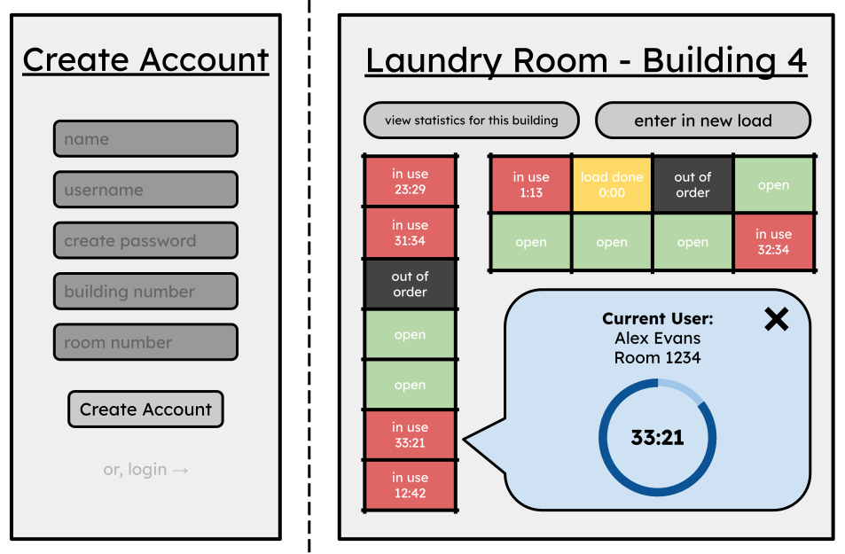

# Laundry Room Timer
*Startup application for BYU CS 260, created by Alex Evans.* [Read development notes for the project](https://github.com/aaevans03/startup/blob/main/notes.md)

## Specification Deliverable

### Elevator Pitch
Have you ever lived in an apartment or dormitory building where everyone has to share the same laundry machines? Then you must know the drudgery of lugging your laundry down to the basement, only to find that all of the machines are already being used. With this new web application, I aim to provide a solution to this. As soon as users start a load of laundry, they can log in onto the website and select which laundry machines they are using, so other residents can easily view how busy the laundry room is. Users are able to set timers for their own loads, view load times for other machines, and join a waiting queue if the room is too busy.

### Design

### Key Features
- User accounts system, where users input their building number, and room number
- Ability to enter in which laundry machines a user is currently using, with a built-in timer system
- Live, realtime updates for laundry room use
- Ability to see which user is using which machine
- A notification system that alerts user when their laundry machines are done
- A waitlist queue for use during busy laundry room times
- An ability to view statistics of when the busiest times for the laundry room is

### Technologies

Here is a list of the technologies I will implement.

- **HTML** - Uses correct HTML structure on three pages: a login page, the laundry room interface page, and an about page. Hyperlinks between the pages.
- **CSS** - A simple, clean, easy-to-use design that can fit any device size.
- **JavaScript** - Account creation, login, laundry machine selection, timer setting, viewing machine progress, waitlist queue, analysis of laundry times from a database.
- **React** - Used to put the application and whole user interface onto a single page.
- **Web services**
    - Uploading user's laundry machine use
    - Retrieving laundry machine times
    - Randomly selected quote about laundry (from own database)
    - Randomly selected laundry GIF from GIPHY
    <!-- Ideally, the ability to link into BYU's own network for laundry rooms, but I may not have access to that, unfortunately. -->
    <!-- Also, the ability to prove you live in the building with your BYU login.-->
- **Authentication/Database** - The ability to create accounts and login. Stores login information, building number, and room number. Cannot use laundry machines, unless you live in the building.
- **WebSocket** - Live updates of laundry room use visible to all users

## HTML Deliverable

For this deliverable, I built the structure of my web app using HTML. There is no functionality, but there are many placeholders for where all of the future technologies will go.

- **HTML pages** - Three HTML pages that are linked to each other and are easily accessible
- **HTML tags** - Proper use of BODY, NAV, MAIN, HEADER, and FOOTER tags in the HTML files.
- **Textual Content** - There is lots of text.
    - Notification alert
    - Timer interface, a place to input a new load, a statistics area describing the laundry room's usage
    - A description of the app on the about page, and a laundry quote
- **Web services** - A GIF image that serves as a placeholder for the future random laundry GIF picker. Also, placeholders for laundry machine times, statistics, etc.
- **Images** - The GIF image, a timer image and graph image that will be generated
- **Authentication** - Create account/login interface on the main page.
- **Database/Login** - A placeholder for where the laundry statistics will be displayed, as well as placeholders for laundry machine usage data
- **WebSocket** - Placeholder timers for where the laundry machine times will be displayed, as well as a placeholder for viewing more detailed information about a laundry machine's current usage

## CSS Deliverable

For this deliverable, I completely changed the look of the website using CSS. My main focuses are a clean, simple interface that is responsive to window size.

- **Header, footer, and main content body** - A header and footer have been created, which stay static with the CSS flex feature.
- **Navigation elements** - I made the navigation elements simple so that they match the text on the rest of the page. No underlines or page-visited color changes.
- **Responsive to window resizing** - My application will change element and font sizes to match the user's screen size, in order to ensure maximum usability.
- **Application elements** - I improved the login screen. On the laundry room page, I added elements such as a pop-up window when you want to look at statistics or input a new load, as well as colors and a simple way to look at the laundry room machines. Finally, on the about page, I formatted the next nicely.
- **Application images** - Integrated the GIF nicely besides some text. Also, implemented the timer as a progress bar.

## React Deliverable

For this deliverable, I coded the app with JavaScript and React so it all works locally for a single user.

- **Converted and bundled** - Application converted to use React, and bundled using Vite
- **Components**
  - **Individual Laundry Machines** - Used JavaScript to write code for each laundry machine storing information about who is using it
    - Wrote a timer script to keep track of how much time is left in machines (currently only client-side, in the future will be using **websocket**)
    - Color of machines dynamically change depending on if machines are being used or not
  - **Dynamic Machine Viewer** - Used React to dynamically change the machine viewer, so that when you click on a machine you can see who is using it and how much time is left
  - **Add Laundry Loads** - Added ability to add your own new loads, user interaction currently simulated by automated loads of other people being started (in the future will use **websockets**)
  - **Statistics Viewer** - Will be implemented in the future and use a **databse**
- **Routes** - Used a React Router to route the user through login, laundry room, and about components
- **Hooks** - Uses `useState()` to update machine information displayed on the screen